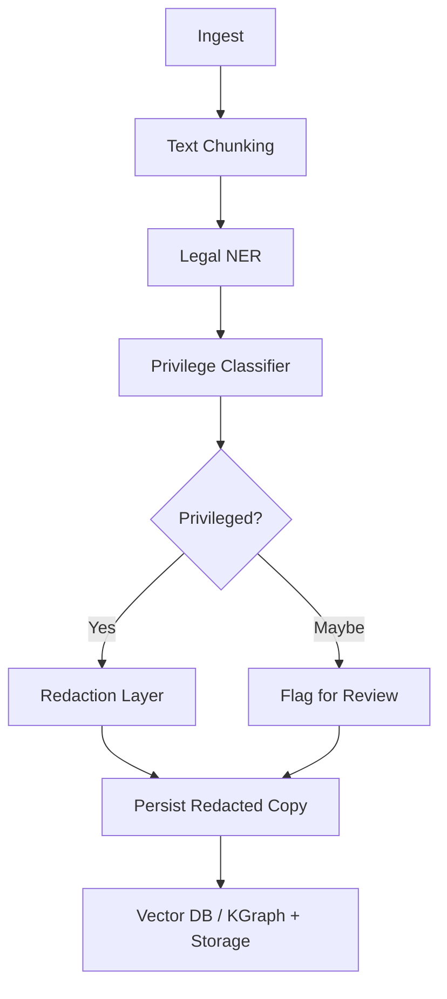

# Legal Document Processing Pipeline

## 1. Pipeline Overview

The following is a high-level overview of the legal document processing pipeline visualized using a flowchart:



## 2. Model Design

### A. Named Entity Recognition (NER) Model

- **Initial Model:** Start with `en_legal_ner_md` or `legal-bert`.
- **Entity Detection:** Identify entities such as:
  - LAWYER_NAME
  - CLIENT_NAME
  - EMAIL
  - PHONE
  - CASE_REF
  - LEGAL_OPINION
  - PRIVILEGED_CONTENT
- **Fine-tuning:**
  - Use annotated corpora if available.
  - Alternatively, generate synthetic attorney–client samples for training.

### B. Privilege Classifier

- **Classification:** Binary classification into Privileged, Non-Privileged, or Uncertain.
- **Features:**
  - Entity density.
  - Pattern recognition (e.g., "pursuant to your request", "our legal opinion", "confidential memo").
  - Context window analysis using sentence embeddings (e.g., SBERT).

## 3. Redaction Layer

### A. Redaction Helpers

Implement a function to redact privileged spans:

```python
def redact_privileged_spans(text, spans):
    redacted = text
    for span in sorted(spans, key=lambda s: s.start, reverse=True):
        label = f"[REDACTED: {span.label}]"
        redacted = redacted[:span.start] + label + redacted[span.end:]
    return redacted
```

### B. PDF/Text Handling

- **Text Redaction:** Straightforward string replacement.
- **PDF Redaction:** Use `PyMuPDF` (fitz) or `pdfplumber` + `reportlab` to apply redactions to PDF files.

### C. Metadata Handling

- Store original spans and reasons in a `redaction_log` table.
- Ensure the original version is never exported if redactions are active.
- Add `is_redacted`, `is_privileged`, and `needs_review` attributes to the Document model.

## 4. Attorney Review Interface

### A. UI Features

- Toggle between redacted and original versions (internal use only).
- Allow override capabilities:
  - ✅ Not Privileged → Release original.
  - ❌ Confirm Privileged → Retain redacted version.

### B. Audit Log Schema

Define the audit log schema:

```sql
CREATE TABLE redaction_audit (
    id UUID PRIMARY KEY,
    document_id UUID,
    reviewer TEXT,
    action TEXT CHECK(action IN ('confirm', 'override')),
    timestamp TIMESTAMP,
    reason TEXT
);
```

## 5. Batch Processing Framework

Integrate into the existing ingestion flow:

```python
text = processor.extract_text(file)
chunks = chunker.split(text)
for chunk in chunks:
    entities = ner_model.predict(chunk)
    if is_privileged(entities, chunk):
        redacted = redact_privileged_spans(chunk, entities)
        mark_document_as_privileged(doc_id)
        store_redacted_version(doc_id, redacted)
```

## 6. Storage & Safety

- Store all redacted files in the `/redacted/` directory.
- Keep original files in `/secure_storage/` with restricted access.
- Index redacted copies for search and analysis.
- Use ChromaDB & Neo4j on redacted or sanitized versions only.

## 7. Testing / Evaluation

- Use a benchmark dataset such as the CORD-19 Legal Subset.
- Manually label privileged vs. non-privileged sets.
- Evaluate precision and recall for:
  - Privileged detection.
  - Correct redaction.

## 8. Deployment Plan

- Deploy as an asynchronous pipeline within the upload route.
- Add a manual override UI to `/admin/review`.
- Notify attorneys via dashboard for items marked as “Needs Review”.

## 9. Future Enhancements

- Implement fine-grained privilege type detection:
  - Work Product Doctrine.
  - Joint Defense / Common Interest.
- Detect chat message streams (e.g., Slack/email threads).
- Develop multilingual legal redaction capabilities (e.g., Spanish, French, etc.). 

This enhanced prompt provides a comprehensive guide for developing a robust legal document processing pipeline with clear steps and detailed descriptions, ready for implementation.
