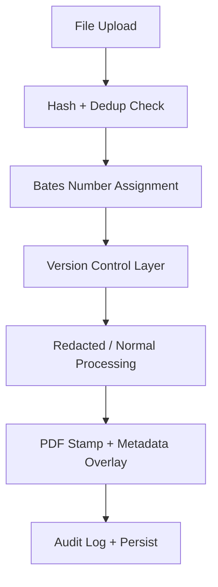

# Real-Time Bates Stamping & Versioning System

## Objective
The goal of this system is to eliminate versioning chaos and compliance ambiguity by automatically stamping, tracking, and forensically auditing every document from ingest to export.

## Pipeline Overview



## Functional Components

### 1. Bates Numbering Service

#### A. Database Table: `bates_counter`
```sql
CREATE TABLE bates_counter (
  id SERIAL PRIMARY KEY,
  prefix TEXT NOT NULL DEFAULT 'BATES',
  current_number INTEGER NOT NULL DEFAULT 0
);
```
**Initialization:**
```sql
INSERT INTO bates_counter (prefix, current_number) VALUES ('ABCD', 0);
```

#### B. Auto-Incrementing Logic (Atomic)
```python
from sqlalchemy import text

def get_next_bates_number(db, prefix="ABCD"):
    with db.begin():
        row = db.execute(
            text("UPDATE bates_counter SET current_number = current_number + 1 WHERE prefix = :p RETURNING current_number"),
            {"p": prefix}
        ).fetchone()
    return f"{prefix}_{row.current_number:06d}"
```

### 2. Hashing & Version Control

#### A. Database Table: `document_versions`
```sql
CREATE TABLE document_versions (
  id UUID PRIMARY KEY,
  document_id UUID REFERENCES documents(id),
  version_number INTEGER,
  file_hash TEXT,
  file_path TEXT,
  bates_start TEXT,
  bates_end TEXT,
  created_at TIMESTAMP DEFAULT now(),
  uploaded_by TEXT,
  change_reason TEXT
);
```

#### B. Versioning Flow
- **On Upload:** 
  - Compute SHA-256.
  - If hash matches, skip upload and notify duplicate.
  - If hash differs, increment `version_number`, assign new Bates range.
  - Attach metadata differences (e.g., filename, content, size, user).

### 3. Bates Stamping (Visual Overlay)

#### A. PDF Stamping (Using PyMuPDF / ReportLab)
```python
def stamp_bates_number(file_path, output_path, start_bates_number):
    doc = fitz.open(file_path)
    for i, page in enumerate(doc, start=start_bates_number):
        stamp = f"ABCD_{i:06d}"
        page.insert_text((50, 20), stamp, fontsize=8, color=(0, 0, 0), overlay=True)
    doc.save(output_path)
```

#### B. Metadata Range
- Store `bates_start` and `bates_end` on version.
- Auto-assign range for multipage PDFs.
- Use document-wide stamp for single files.

### 4. Chain of Custody

#### A. Database Table: `audit_trail`
```sql
CREATE TABLE audit_trail (
  id UUID PRIMARY KEY,
  document_version_id UUID,
  event_type TEXT CHECK (event_type IN ('upload', 'replace', 'stamp', 'export')),
  event_time TIMESTAMP DEFAULT now(),
  user TEXT,
  note TEXT
);
```
- Log each action (edit, stamp, replace, export) in the audit trail.

### 5. UI / UX Integration

#### A. Upload Form
- Display real-time assigned Bates number.
- Highlight version if a new revision is detected.

#### B. “Bates Stamp This Set” Feature
- UI button in document set view.
- Backend triggers stamping job, returns ZIP or PDF bundle.
- CLI command: `python tools/stamp.py --set SET_ID --prefix ABCD`

### 6. Compliance/Export Modes

#### A. Bulk Export
- Export redacted or normal version based on access.
- Include `manifest.csv` with:
  - Filename
  - Bates Range
  - Hash
  - Version ID
  - Upload time

#### B. Custom Format
- Allow users to define:
  - Prefix
  - Start number
  - Margin location (footer, header, etc.)
  - Font size & color

### 7. Testing and Forensic Validation

- **Unit Tests:**
  - Ensure uniqueness of Bates numbers.
  - Confirm visual overlay exists on each page.
  - Validate consistent hash across versions.
- **File Diff Tool:**
  - Visual comparison between version N and N+1.
  - Highlighted metadata changes.

### 8. Future Enhancements

- OCR stamping on scanned pages.
- Blockchain-anchored chain-of-custody hashes.
- Immutable audit trails with digital signatures.
- AI-based version similarity scoring.

This enhanced prompt provides a comprehensive overview of the Real-Time Bates Stamping & Versioning System, ensuring clarity and precision for implementation.
